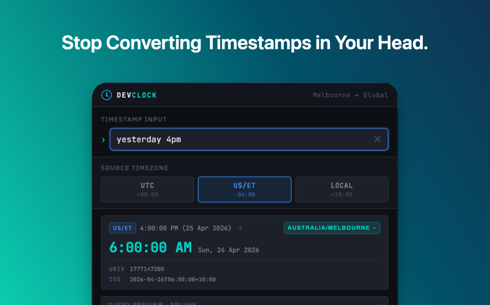

# DevClock




DevClock is a compact Chrome extension that helps engineers convert timestamps from configurable source timezones into a configurable local target timezone and generate copy-ready query windows for multiple log providers.

## Why this exists

When troubleshooting logs, teams often receive timestamps from mixed regions and formats. DevClock removes manual timezone math and gives a copy-ready query fragment instantly.

## Features

- Converts to a configured target timezone with DST-aware handling
- Supports multiple input styles — epoch, ISO 8601, shorthand, natural language, and log-native formats
- Generates provider-specific query windows (±1 minute by default)
- Supports query output for `splunk`, `grafana`, and `cloudwatch`
- 12h/24h display modes
- Configurable source timezone toggles and target timezone from the Preferences page
- One-click copy for converted time and provider query fragment

## Quick start

1. Open `chrome://extensions/`
2. Enable **Developer mode**
3. Click **Load unpacked** and select the `dist/` folder (see [Build](#build))

Default shortcut:
- Windows/Linux: `Ctrl+Shift+T`
- macOS: `Cmd+Shift+T`

Adjust at `chrome://extensions/shortcuts`.

## Supported input formats

Inputs are tried in priority order until one succeeds.

### Cleanup / shorthand

| Format | Example |
|--------|---------|
| Bracket / noise wrapped | `[2024-06-10T14:30:00Z]`, `("2024-06-10T14:30:00Z")` |
| Relative shorthand | `-2h`, `-30m`, `now-1h`, `-45s` |

### Unix Epoch

| Format | Example |
|--------|---------|
| Epoch seconds (10 digits) | `1718000000` |
| Epoch milliseconds (13 digits) | `1718000000000` |

### ISO 8601

| Format | Example |
|--------|---------|
| UTC (`Z` suffix) | `2024-06-10T14:30:00Z` |
| With milliseconds | `2026-04-25T04:15:22.455Z` |
| With explicit offset | `2024-06-10T09:00:00-05:00` |
| Naive (no timezone) | `2024-06-10T14:30:00` |
| Space separator | `2026-04-25 04:15Z` |
| Trailing TZ abbreviation | `2026-04-25T14:30:00 PST` |

### Log-native / loose formats

| Format | Example |
|--------|---------|
| Apache CLF-style | `10/Oct/2000:13:55:36 -0700` |
| Syslog-like | `Oct 10 13:55:36` |
| Space-separated with ms | `2026-04-25 14:30:22.455` |
| Time with ms only | `14:30:22.455` |
| Trailing abbreviation | `2026-04-25 14:30 AEDT` |

### Natural language

| Format | Example |
|--------|---------|
| Time only (24h) | `09:00`, `14:30` |
| Time only (12h) | `3:14pm`, `9am` |
| Military time | `1545`, `0900` |
| Today / yesterday / tomorrow | `today at 5pm`, `yesterday at 5pm`, `tomorrow 9am` |
| Last weekday | `last Monday 08:30`, `last Friday at 3pm` |
| Month + day | `October 30th 2pm`, `January 1st 9am` |
| Chrono phrases | `next friday 4pm`, `2 hours ago`, `tomorrow noon` |

## Preferences

Open the popup → click **Preferences** to configure:

- **Default target timezone** — the timezone all timestamps are converted to
- **Source timezone toggles** — which quick-toggle buttons appear in the popup (`UTC` and `LOCAL` always included)
- **Query provider** — `splunk`, `grafana`, or `cloudwatch`
- **Time display format** — `24h` or `12h`

All preferences persist across browser restarts.

### Query provider output

- `splunk`: `_time >= "..." AND _time <= "..."`
- `grafana`: `from=<epoch_ms>&to=<epoch_ms>`
- `cloudwatch`: `filter @timestamp >= '...' and @timestamp <= '...'`

## Build

```
npm install
npm run build:extension   # outputs to dist/
```

Load `dist/` as an unpacked extension in Chrome.

## Contributing

<details>
<summary>Developer notes</summary>

### Tech stack

- Vanilla HTML/CSS/JS — no framework
- [Luxon](https://moment.github.io/luxon/) (local bundle) for timezone-aware parsing
- [chrono-node](https://github.com/wanasit/chrono) and [any-date-parser](https://github.com/kensnyder/any-date-parser) for natural-language and log-native fallback parsing
- Chrome Extension Manifest V3

### Run tests

```
npm run test:unit           # unit tests (Node test runner)
npm run test:integration    # BDD/Gherkin tests via Cucumber + Playwright
```

Playwright browser runtime (first time only):

```
npx playwright install chromium
```

### Release

```
npm run release:patch   # 1.x.y → 1.x.(y+1)
npm run release:minor   # 1.x.y → 1.(x+1).0
npm run release:major   # 1.x.y → 2.0.0
```

Each release command runs integration tests, bumps the version, syncs `manifest.json`, commits, and pushes with a tag. CI publishes a GitHub Release from the tag.

### Snapshot artifacts

CI on push/PR uploads `dev-clock-extension-snapshot-<commit_sha>.zip` (short retention). Tagged releases publish `dev-clock-extension-v<version>.zip` to GitHub Releases.

</details>

## Roadmap

- Configurable query window size
- Additional query providers
- One-click paste into active tab input

## Privacy Policy

[https://kokilaw.github.io/dev-clock-extension/privacy-policy.html](https://kokilaw.github.io/dev-clock-extension/privacy-policy.html)

